<div align="center">

# web-harness

**A guardrail that keeps AI from wrecking your code**

AI development harness v1.1.0

[한국어](README.md) · [English](README.en.md)

</div>

## In one line

When you build with Claude Code or Codex, rules are **enforced by automatic checks** instead of being asked for in a document. Every session follows the same rules and the same working order.

## Why

Long AI sessions tangle code. Today's session doesn't know what yesterday's agreed on, and small "this is fine" shortcuts pile up until the AI trips over its own code. Fix one feature and another breaks; eventually rebuilding is faster than fixing.

A developer can at least spot it. If you can't read code, all you can do is trust "it's done". This tool plays the role of someone who reads the code and checks it every time.

| | Without | With |
|:--|:--|:--|
| New session | Forgets past agreements | Same rules every time |
| A rule is broken | Someone finds out later | Flagged right after saving; the AI fixes it |
| Order of work | Writes code as soon as asked | Writes code only after you approve a plan |
| "Done" | May be just words | Merged into the main copy only after all checks pass |
| A check can't run | Looks like a pass | Reported as "did not run", with the reason |

## Getting started

**1. Get it**

```bash
git clone https://github.com/Gruci/web-harness.git my-project
cd my-project
rm -rf .git && git init && git add -A && git commit -m "init"
```

**2. Open Claude Code and say**

```
set up the harness
```

It asks what you want to build — no technical terms needed. If the language or framework isn't decided, it explains what changes with each option and you choose. It creates the settings file, prepares checks for the stack you chose and connects GitHub.

**3. Just build**

```
build a login feature
```

That's all. The rest is reference.

## How work flows

```
[questions] → [research] → [plan] → [approval] → [build + checks] → [pre-merge check] → [merge]
                                        ▲
                                  where you answer
```

- It asks about scope first, then waits for you to approve the plan. Those are the only two places you answer.
- The plan names the files to change and includes real code. Blanks like "implement later" make it invalid.
- Building happens in a separate work copy (worktree) for each task. The main folder holds only plans and the work board.
- Every save runs the checks and reports violations; the AI fixes them right away. Inside a work copy they are reported, not blocked.
- Merging into the main copy or pushing reruns every check first. Nothing is merged while violations remain.
- Screen work starts with a mockup file you approve, and the build follows it exactly.

## What it catches

A few examples. The full list is in the [harness map](dev/HARNESS.md).

| Caught | Why |
|:--|:--|
| New code with no assigned component | Decide where it belongs first so the structure holds |
| Hard-coded colors in screen code | Colors live in one place |
| Fixed pixel widths | They break phone screens |
| Files over 400 lines, functions over 80 | One file, one function, one job |
| API keys in source | Move them to settings; rotate if already pushed |
| Docs pointing at files that don't exist | Leftovers from a rename |
| An existing function rebuilt under a new name | One job, one place |
| An API with no screen that uses it | Users can't see it |

## Reading check results

| Mark | Meaning | What to do |
|:--|:--|:--|
| `[OK]` | Checked, no problems | Nothing |
| `[FAIL]` | Rule broken | Fix it. It won't be merged into the main copy until fixed |
| `[WIP]` | A violation inside a work copy | Fix it before merging. It doesn't block while you work |
| `[SKIP]` | Settings empty, so it didn't run | Fill in the setting. Not a pass |
| `[N/A]` | Doesn't apply to this kind of project | Nothing |
| `[TOOL]` | A required tool is missing | Install it. Not counted as done |
| `[DECISION]` | A new classification needs your decision | Answer the proposal |
| `[REPORT]` | An uncertain signal | Take a look |

Guesses never block. For example, "this work copy looks finished" is only a warning; you can still end the session.

## FAQ

**Can I install it before choosing a stack?**
Yes. No language is assumed; you decide together before the first line of code.

**Does it work without Python?**
Yes. Python, Go and TypeScript language packs and one server and one screen framework pack are included (`kernel/langs/`, `kernel/frameworks/`). For another language or framework, setup creates a pack from a template and `python -X utf8 -m kernel.pack_check` confirms the checks actually turn on. Languages other than Python need tree-sitter; without it those checks show `[TOOL]` and don't count as passing.

**My service has no screens, but screen checks keep showing `[SKIP]`.**
Put `ARCH = "backend_only"` (server only) or `ARCH = "headless"` (no web, no screens) in `harness_profile.py`. They become `[N/A]`. If you do have screens and screen checks show `[SKIP]`, list your framework pack names (file names in `kernel/frameworks/`) in `FRAMEWORK`.

**Do I need to create the GitHub repository first?**
If `gh` is logged in, a private repository is created for you. It asks for an address only when it isn't.

**How do I update the harness?**
`python -X utf8 harness_install.py --check-update` tells you whether a new version exists. To update, commit your changes and run `--upgrade`. Only the check engine, check scripts and presets change; your settings, docs and diagrams stay.

## Using it with Codex

Claude Code and Codex share the rules, the working steps and the check engine. The shared steps are in the [workflow index](dev/workflows/README.md).

```bash
python -X utf8 setup_global_permissions.py --agent both   # set up both tools at once
python -X utf8 harness_install.py --check-agents          # check the wiring
```

For the Codex side, Python 3.11+ is recommended (3.10 needs the `toml` package). Changes apply from the next session, and host policies such as company settings take precedence.

## Work happens in work copies

- One session or many, every task gets its own work copy at `worktrees/<task scope>--<session tag>`, so the list shows who is doing what.
- Starting a task registers it on the work board (`workboard/`). Editing code without registering is blocked.
- Touching a scope another session has claimed shows a warning.
- While a work copy exists, commits and branch switches in the main folder are blocked. Merge a finished branch with `git merge --ff-only <branch>`.
- Every check runs in that folder right before push, PR or merge, and nothing goes out until it passes.

## Manual install

```bash
python -X utf8 harness_install.py --doctor            # check required external tools
python -X utf8 harness_install.py                     # create settings and verify
python -X utf8 setup_global_permissions.py            # Claude Code global permissions
```

You need a Git repository, a GitHub remote and Python 3.10+. Screen quality checks and diagrams need Node.js; Go and TypeScript analysis needs tree-sitter. `--doctor` lists anything missing.

For a project that already has code, run `--dry-run` first to see current violations.

## Diagrams

Diagrams of the harness itself. Every box is linked to real source lines, and changing the code without updating the diagram fails a check. Open the matching `.html` in `docs/architecture/` to click from a box to its code. Installing into a new project removes these diagrams; the project's own diagrams are made with the arch-diagram skill.

| Structure | Order of automatic checks |
|:--|:--|
|  |  |
| **Saving one file** | **What is checked when** |
|  |  |

## Changelog

| Version | Changes |
|:--|:--|
| **v1.1.0** | Languages and frameworks move into packs, and setup fits the checks to the stack you choose. Work-copy isolation and the pre-merge check are enforced in both Claude Code and Codex. Finished branches can be merged by fast-forward. A fresh install into a new project now passes its checks. |
| **v1.0.0** | First public release. |

## License

Daehyun Kim · [LinkedIn](https://www.linkedin.com/in/daehyun-kim-b00365176/)

MIT License
