<div align="center">

# agent-harness

**AI가 내 코드를 망치지 않게 잡아주는 가드레일**

AI 개발 하네스 v2.1.0

[한국어](README.md) · [English](README.en.md)

</div>

## 한 줄로

Claude Code나 Codex와 개발할 때 규칙을 문서로 부탁하는 대신 **자동 검사로 막습니다.** 세션이 바뀌어도 같은 규칙과 같은 작업 순서를 지키게 됩니다.

## 왜 필요한가요

AI와 오래 개발하면 코드가 꼬입니다. 어제 합의한 규칙을 오늘 세션은 모르고, "이 정도는 괜찮겠지"가 쌓이면 AI가 자기가 만든 코드에 발이 걸립니다. 기능 하나를 고치면 다른 곳이 깨지고, 결국 처음부터 다시 만드는 게 빠른 지경이 됩니다.

개발자라면 눈으로 알아채기라도 하지만, 개발을 모르면 "다 됐습니다"라는 말을 믿는 수밖에 없습니다. 이 도구는 코드를 읽을 줄 아는 사람이 옆에서 매번 검사해 주는 역할을 대신합니다.

| | 쓰기 전 | 쓴 후 |
|:--|:--|:--|
| 세션이 바뀌면 | 지난 합의를 잊습니다 | 같은 규칙이 매번 적용됩니다 |
| 규칙을 어기면 | 나중에 사람이 발견합니다 | 저장 직후 알려주고 AI가 고칩니다 |
| 작업 순서 | 요청하자마자 코드를 씁니다 | 설계서를 승인해야 코드를 씁니다 |
| "다 됐어요" | 말뿐일 수 있습니다 | 전체 검사를 통과해야 본체에 합쳐집니다 |
| 검사가 못 돌면 | 통과한 것처럼 보입니다 | "못 돌았다"고 이유와 함께 알려줍니다 |

## 시작하기

**1. 받기**

Claude Code 플러그인으로 깝니다. 프로젝트 폴더에는 아무것도 복사되지 않고, 연결한 프로젝트에서만 검사가 돕니다.

```
/plugin marketplace add Gruci/agent-harness
/plugin install agent-harness@agent-harness
```

Codex도 함께 쓰거나 작업 사본·작업 보드 절차까지 쓰려면 템플릿으로 받습니다. 검사 엔진은 두 방식이 같습니다.

```bash
git clone https://github.com/Gruci/agent-harness.git my-project
cd my-project
rm -rf .git && git init && git add -A && git commit -m "init"
```

**2. Claude Code를 켜고 이렇게 말하기**

```
하네스 깔아줘
```

무엇을 만들고 싶은지 물어봅니다. 기술 용어는 몰라도 됩니다. 언어나 프레임워크가 정해지지 않았으면 후보마다 무엇이 달라지는지 설명해 주고, 고르는 건 직접 합니다. 설정 파일 생성, 고른 스택에 맞춘 검사 준비, GitHub 연결까지 알아서 끝납니다.

**3. 그냥 개발하기**

```
로그인 기능 만들어줘
```

여기까지가 전부입니다. 아래는 필요할 때 찾아보는 내용입니다.

## 개발은 이렇게 흘러갑니다

```
[질문] → [조사] → [설계서] → [승인] → [구현·검사] → [합치기 전 검사] → [합치기]
                              ▲
                        직접 답하는 곳
```

- 처음에 범위를 묻고, 설계서가 나오면 승인을 기다립니다. 직접 답하는 곳은 이 두 곳뿐입니다.
- 설계서에는 바꿀 파일 경로와 실제 코드 조각이 들어갑니다. "나중에 구현" 같은 빈칸이 있으면 설계서로 인정하지 않습니다.
- 구현은 작업마다 따로 만든 작업 사본(worktree)에서 합니다. 본체 폴더에서는 설계서와 작업 보드만 씁니다.
- 파일을 저장할 때마다 검사가 돌아 위반을 알려 주고, AI가 바로 고칩니다. 작업 사본 안에서는 알리기만 하고 막지 않습니다.
- 본체에 합치거나 올리기(push) 직전에 전체 검사를 다시 돌립니다. 위반이 남아 있으면 합쳐지지 않습니다.
- 화면 작업은 시안 파일을 먼저 만들어 승인받고, 승인된 시안 그대로 구현합니다.

## 무엇을 잡아주나요

모든 세션이 지키는 규칙입니다. 어기면 세션이 바로 알게 되고, 고칠 때까지 작업을 합칠 수 없습니다.

<p align="center"></p>
<p align="center"><sub>플러그인을 쓴 세션 기록입니다. 에이전트가 셸로 파일을 쓰려다 거절당하고, 520줄 파일을 써서 400줄 상한에 걸린 뒤, 검사를 우회하지 않고 멈춥니다. 회색 줄은 이 README를 위해 단 설명입니다.</sub></p>

대표적인 것만 적었습니다. 전체 목록은 [하네스 지도](dev/HARNESS.md)에 있습니다.

| 잡히는 것 | 이유 |
|:--|:--|
| 분류되지 않은 새 코드 | 어느 기능에 속하는지 먼저 정해야 구조가 안 무너집니다 |
| 화면 코드의 색상값 직접 입력 | 색상은 한 곳에서만 관리합니다 |
| 고정 픽셀 너비 | 휴대폰 화면이 깨집니다 |
| 400줄 넘는 파일, 80줄 넘는 함수 | 한 파일·한 함수는 한 가지 일만 합니다 |
| 소스에 박힌 API 키 | 설정으로 빼고, 이미 올라갔다면 키를 바꿉니다 |
| 문서에 적힌 파일이 실제로 없음 | 이름을 바꾸고 남은 흔적입니다 |
| 이미 있는 함수를 이름만 바꿔 다시 만듦 | 같은 일은 한 곳에서 합니다 |
| API만 있고 그걸 쓰는 화면이 없음 | 사용자에겐 없는 기능입니다 |

## 검사 결과 읽는 법

| 표시 | 뜻 | 할 일 |
|:--|:--|:--|
| `[OK]` | 검사했고 문제 없음 | 없음 |
| `[FAIL]` | 규칙 위반 | 고칩니다. 고치기 전에는 본체에 합쳐지지 않습니다 |
| `[WIP]` | 작업 사본 안에서 난 위반 | 합치기 전에 고칩니다. 작업 중에는 막지 않습니다 |
| `[SKIP]` | 설정이 비어서 안 돌았음 | 설정을 채우면 켜집니다. 통과가 아닙니다 |
| `[N/A]` | 이 프로젝트 형태엔 해당 없음 | 없음 |
| `[TOOL]` | 필요한 도구가 없어서 못 돌았음 | 도구를 설치합니다. 완료로 치지 않습니다 |
| `[DECISION]` | 새 분류에 사용자 결정이 필요함 | 제안을 보고 답합니다 |
| `[REPORT]` | 확실하지 않은 신호 | 보고 판단합니다 |

틀릴 수 있는 추측으로는 막지 않습니다. 예를 들어 "이 작업 사본은 끝났을 것 같다"는 경고만 하고 세션은 끝낼 수 있습니다.

## 자주 묻는 질문

**기술 스택을 못 정했는데 설치해도 되나요?**
네. 언어를 미리 정하지 않습니다. 첫 코드를 쓰기 전에 함께 정합니다.

**파이썬이 아니어도 되나요?**
됩니다. Python·Go·TypeScript 언어팩과 서버·화면 프레임워크팩이 하나씩 들어 있습니다(`kernel/langs/`·`kernel/frameworks/`). 다른 언어나 프레임워크는 초기 설정 때 템플릿으로 팩을 만들고, `python -X utf8 -m kernel.pack_check`로 검사가 실제로 켜지는지 확인합니다. Python 밖의 언어 분석에는 tree-sitter가 필요하고, 없으면 그 검사는 `[TOOL]`로 표시되며 통과로 치지 않습니다.

**화면이 없는 서비스인데 화면 검사가 계속 `[SKIP]`으로 떠요.**
`harness_profile.py`에 `ARCH = "backend_only"`(서버만) 또는 `ARCH = "headless"`(웹도 화면도 없음)를 적으세요. `[N/A]`로 바뀝니다. 화면이 있는데 화면 검사가 `[SKIP]`이면 `FRAMEWORK`에 쓰는 프레임워크팩 이름(`kernel/frameworks/`의 파일 이름)을 적습니다.

**GitHub 저장소를 미리 만들어야 하나요?**
`gh` 로그인이 돼 있으면 비공개 저장소를 자동으로 만듭니다. 로그인이 안 돼 있을 때만 주소를 묻습니다.

**하네스를 새 버전으로 올리려면요?**
플러그인은 `/plugin update agent-harness@agent-harness`입니다. 템플릿은 `python -X utf8 harness_install.py --check-update`로 새 버전이 있는지 보고, 변경 사항을 커밋한 뒤 `--upgrade`를 실행합니다. 검사 엔진·자동 검사 스크립트·프리셋만 바뀌고 설정·문서는 그대로 둡니다.

**화면 디자인 감사나 구조 그림 도구는 없나요?**
싣지 않습니다. UI 감사 스킬이나 구조 그림 도구가 필요하면 따로 설치합니다. 하네스는 검사 엔진만 담습니다.

## Codex와 함께 쓰기

규칙과 작업 절차, 검사 엔진을 Claude Code와 Codex가 같이 씁니다. 공통 절차는 [작업 절차 모음](dev/workflows/README.md)에 있습니다.

```bash
python -X utf8 setup_global_permissions.py --agent both   # 두 도구를 한 번에 초기화
python -X utf8 harness_install.py --check-agents          # 연결 상태 확인
```

Codex 쪽 설정은 Python 3.11 이상을 권장합니다(3.10이면 `toml` 패키지 필요). 새 세션부터 적용되고, 회사 정책 같은 호스트 설정이 있으면 그쪽이 우선합니다.

## 작업은 작업 사본에서 합니다

- 세션이 하나든 여럿이든 작업마다 작업 사본을 따로 만듭니다. 자리는 `worktrees/<작업 범위>--<세션 표식>`이라 목록만 봐도 누가 무엇을 하는지 보입니다.
- 작업을 시작할 때 작업 보드(`workboard/`)에 등록합니다. 등록하지 않고 코드를 고치면 막힙니다.
- 다른 세션이 잡은 범위를 건드리면 경고가 뜹니다.
- 작업 사본이 있는 동안 본체 폴더에서의 커밋과 브랜치 전환은 막힙니다. 끝난 브랜치는 `git merge --ff-only <브랜치>`로 합칩니다.
- push·PR·merge 직전에 그 폴더에서 전체 검사를 돌리고, 통과해야 나갑니다.

## 직접 설치하기

```bash
python -X utf8 harness_install.py --doctor            # 필요한 외부 도구 확인
python -X utf8 harness_install.py                     # 설정 파일 생성과 검증
python -X utf8 setup_global_permissions.py            # Claude Code 전역 권한 설정
```

필요한 것은 Git 저장소, GitHub 원격 저장소, Python 3.10 이상입니다. 화면 검사에는 Node.js가, Go·TypeScript 분석에는 tree-sitter가 필요합니다. 빠진 도구는 `--doctor`가 알려 줍니다.

이미 코드가 있는 프로젝트라면 `--dry-run`으로 현재 위반을 먼저 봅니다.

## 변경 이력

| 버전 | 변경 내용 |
|:--|:--|
| **v2.1.0** | 하네스가 내는 메시지가 전부 영어로 나옵니다. 검사 결과, 훅 알림, 설치와 진단 출력이 대상이고 판정과 종료 코드는 그대로입니다. 문서는 한국어 그대로입니다. 출력에 한국어가 돌아오면 막는 검사를 더했습니다. |
| **v2.0.0** | Claude Code 플러그인으로 깝니다(`/plugin install agent-harness@agent-harness`). 같은 검사 엔진이 템플릿 설치와 플러그인 설치 양쪽에서 돕니다. 레포 이름이 `agent-harness`로 바뀌었습니다. UI 디자인 감사 스킬과 구조 그림 엔진·그림 검사는 뺐습니다. 필요하면 따로 설치합니다. |
| **v1.1.0** | 언어·프레임워크를 팩으로 분리하고, 초기 설정에서 고른 스택에 맞춥니다. 작업 사본 격리와 합치기 전 검사를 Claude Code·Codex 양쪽에 강제합니다. 끝난 브랜치의 fast-forward 합치기를 허용합니다. 새로 받은 프로젝트의 첫 설치가 검사를 통과하지 못하던 문제를 고쳤습니다. |
| **v1.0.0** | 첫 공개 버전. |

## 라이선스

Daehyun Kim · [LinkedIn](https://www.linkedin.com/in/daehyun-kim-b00365176/)

MIT License
