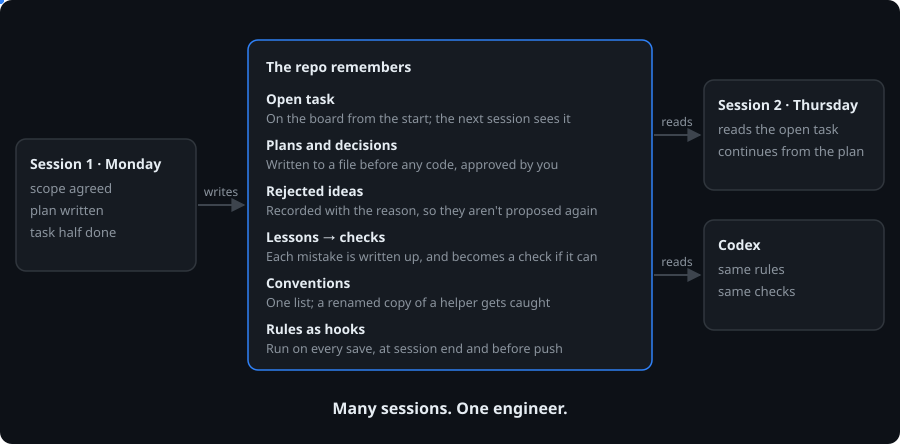

<div align="center">

# agent-harness

**Every AI session picks up where the last one left off — as if one engineer did all the work.**

Plans, decisions, conventions and lessons stay in the repo, and hooks keep every session working from them —
Claude Code or Codex, today's session or next month's.

agent-harness v2.1.0 · Claude Code · Codex

[English](README.md) · [한국어](README.ko.md)



</div>

## What carries over between sessions (template)

| | Without | With agent-harness |
|:--|:--|:--|
| A new session starts | You explain the project again | It gets the open tasks, reads their plans and continues from the next step |
| Yesterday's decisions | Gone with the chat | Kept in the plan. Rejected ideas are recorded so they are not proposed again |
| Conventions | Each session invents its own | One registry. A renamed copy of an existing function is caught |
| A mistake | Happens again next week | Written up as a lesson, and turned into a check when it can be |
| Several sessions at once | They overwrite each other | One worktree per task. A shared board shows who has what |
| Claude Code and Codex | Follow different rules | Read the same rules and run the same checks |
| "Done" | A claim | The full check has to pass before the work merges |

## Two ways to install

| | Template — the full harness | Plugin — the checks only |
|:--|:--|:--|
| How | Clone into a new project | Two commands in Claude Code, on any existing repo |
| Open tasks, plans, decisions and lessons carried to the next session | ✓ | — |
| Checks on save, at session end, before push | ✓ | ✓ |
| Blocks writing source files through the shell | ✓ | ✓ |
| Plan before code: scope → research → plan → your approval | ✓ | — |
| One worktree per task and a shared task board | ✓ | — |
| Requires a GitHub remote | ✓ | — |
| Codex support | ✓ | — |
| Lessons become gates, the harness map stays in sync, maintenance reminders | ✓ | — |
| Update | `python -X utf8 harness_install.py --upgrade` | `/plugin update agent-harness@agent-harness` |

## Quick start — template

```bash
git clone https://github.com/Gruci/agent-harness.git my-project
cd my-project
rm -rf .git && git init && git add -A && git commit -m "init"
```

Open Claude Code in the folder and say:

```
set up the harness
```

It asks what you want to build — no technical terms needed. If the language or framework isn't decided, it explains what changes with each option and you choose. It creates the settings file, prepares checks for the stack you chose and connects GitHub. Then just ask for work:

```
add a login feature
```

## Quick start — plugin

```
/plugin marketplace add Gruci/agent-harness
/plugin install agent-harness@agent-harness
```

Then, in a repo you want checked, say `set up the harness`. Nothing is copied into your project folder, and repos you don't connect are left alone.

## How a change flows (template)

```
[questions] → [research] → [plan] → [approval] → [build + checks] → [pre-merge check] → [merge]
                                        ▲
                                  where you answer
```

- It asks about scope first, then waits for you to approve the plan. Those are the only two places you answer.
- The plan names the files to change and includes real code. Blanks like "implement later" make it invalid.
- Building happens in a separate work copy (worktree) for each task. The main folder holds only plans and the work board.
- Every save runs the checks and reports violations; the AI fixes them right away. Inside a work copy they are reported, not blocked.
- Merging into the main copy or pushing reruns every check first. Nothing is merged while violations remain.
- Screen work starts with a mockup file you approve, and the build follows it exactly.

## What it catches

The rules every session works under. When one is broken the session hears about it right away, and the work cannot merge until it is fixed.

<p align="center"></p>
<p align="center"><sub>A recorded session with the plugin. The agent tries to write a file through the shell and is refused, writes a 520-line file and hits the 400-line limit, then stops instead of working around the gate. The grey lines are notes added for this README.</sub></p>

A few examples. The full list is in the [harness map](dev/HARNESS.md).

| Caught | Why |
|:--|:--|
| New code with no assigned component | Decide where it belongs first so the structure holds |
| Hard-coded colors in screen code | Colors live in one place |
| Fixed pixel widths | They break phone screens |
| Files over 400 lines, functions over 80 | One file, one function, one job |
| API keys in source | Move them to settings; rotate if already pushed |
| Docs pointing at files that don't exist | Leftovers from a rename |
| An existing function rebuilt under a new name | One job, one place |
| An API with no screen that uses it | Users can't see it |

## Reading check results

| Mark | Meaning | What to do |
|:--|:--|:--|
| `[OK]` | Checked, no problems | Nothing |
| `[FAIL]` | Rule broken | Fix it. It won't be merged into the main copy until fixed |
| `[WIP]` | A violation inside a work copy | Fix it before merging. It doesn't block while you work |
| `[SKIP]` | Settings empty, so it didn't run | Fill in the setting. Not a pass |
| `[N/A]` | Doesn't apply to this kind of project | Nothing |
| `[TOOL]` | A required tool is missing | Install it. Not counted as done |
| `[DECISION]` | A new classification needs your decision | Answer the proposal |
| `[REPORT]` | An uncertain signal | Take a look |

Guesses never block. For example, "this work copy looks finished" is only a warning; you can still end the session.

## FAQ

**Can I install it before choosing a stack?**
Yes. No language is assumed; you decide together before the first line of code.

**Does it work without Python?**
Yes. Python, Go and TypeScript language packs and one server and one screen framework pack are included (`kernel/langs/`, `kernel/frameworks/`). For another language or framework, setup creates a pack from a template and `python -X utf8 -m kernel.pack_check` confirms the checks actually turn on. Languages other than Python need tree-sitter; without it those checks show `[TOOL]` and don't count as passing.

**My service has no screens, but screen checks keep showing `[SKIP]`.**
Put `ARCH = "backend_only"` (server only) or `ARCH = "headless"` (no web, no screens) in `harness_profile.py`. They become `[N/A]`. If you do have screens and screen checks show `[SKIP]`, list your framework pack names (file names in `kernel/frameworks/`) in `FRAMEWORK`.

**Do I need to create the GitHub repository first?**
If `gh` is logged in, a private repository is created for you. It asks for an address only when it isn't.

**How do I update the harness?**
For the plugin, `/plugin update agent-harness@agent-harness`. For the template, `python -X utf8 harness_install.py --check-update` tells you whether a new version exists; commit your changes and run `--upgrade`. Only the check engine, check scripts and presets change; your settings and docs stay.

**Is there a UI design audit or an architecture diagram tool?**
Not included. If you need a UI audit skill or a diagram tool, install one separately. The harness ships only the check engine.

## Using it with Codex (template)

Claude Code and Codex share the rules, the working steps and the check engine. The shared steps are in the [workflow index](dev/workflows/README.md).

```bash
python -X utf8 setup_global_permissions.py --agent both   # set up both tools at once
python -X utf8 harness_install.py --check-agents          # check the wiring
```

For the Codex side, Python 3.11+ is recommended (3.10 needs the `toml` package). Changes apply from the next session, and host policies such as company settings take precedence.

## Work happens in work copies (template)

- One session or many, every task gets its own work copy at `worktrees/<task scope>--<session tag>`, so the list shows who is doing what.
- Starting a task registers it on the work board (`workboard/`). Editing code without registering is blocked.
- Touching a scope another session has claimed shows a warning.
- While a work copy exists, commits and branch switches in the main folder are blocked. Merge a finished branch with `git merge --ff-only <branch>`.
- Every check runs in that folder right before push, PR or merge, and nothing goes out until it passes.

## Manual install (template)

```bash
python -X utf8 harness_install.py --doctor            # check required external tools
python -X utf8 harness_install.py                     # create settings and verify
python -X utf8 setup_global_permissions.py            # Claude Code global permissions
```

You need a Git repository, a GitHub remote and Python 3.10+. Screen checks need Node.js; Go and TypeScript analysis needs tree-sitter. `--doctor` lists anything missing.

For a project that already has code, run `--dry-run` first to see current violations.

## Changelog

| Version | Changes |
|:--|:--|
| **v2.1.0** | Every message the harness prints is now English: check results, hook notices, install and doctor output. Verdicts and exit codes are unchanged. The docs stay Korean. A new check blocks Korean output from coming back. |
| **v2.0.0** | Installs as a Claude Code plugin (`/plugin install agent-harness@agent-harness`). The same check engine runs in both the template install and the plugin install. The repository is renamed `agent-harness`. The UI design audit skill and the diagram engine with its diagram check are removed; install them separately if needed. |
| **v1.1.0** | Languages and frameworks move into packs, and setup fits the checks to the stack you choose. Work-copy isolation and the pre-merge check are enforced in both Claude Code and Codex. Finished branches can be merged by fast-forward. A fresh install into a new project now passes its checks. |
| **v1.0.0** | First public release. |

## License

Daehyun Kim · [LinkedIn](https://www.linkedin.com/in/daehyun-kim-b00365176/)

MIT License
